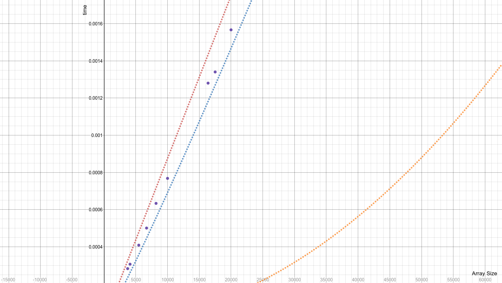
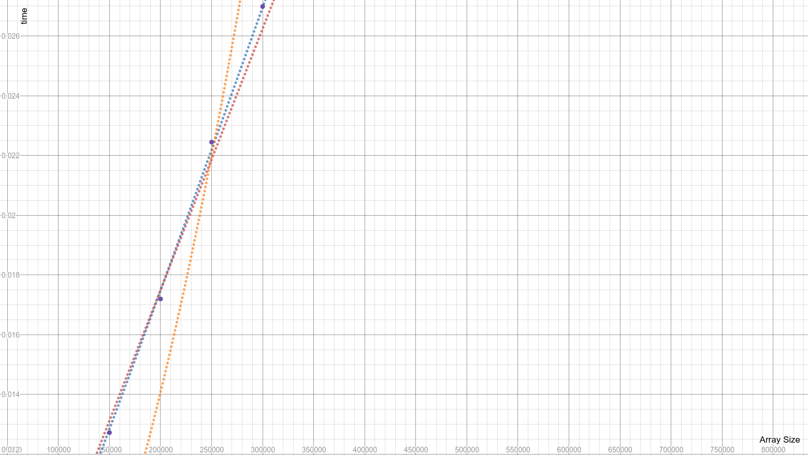

************
###QueenTerrysSun
APCS2 pd03  
3/9/2017  
**QuickSort Lab**
************

##Runtime Classification:

###Best Run Time: O( nlog(n) )
In the best case scenario, QuickSort will be using a pivot point that roughly partitions the array being examined in half each time the recursion is called (i.e. if n = the length of the array, then the array will be partitioned into two arrays like so: [n/2 elements], [n/2 elements]. For an array of an odd number length, being partitioned into [n/2 elements], [n/2 + 1 elements] is fine.) This action of repeatedly splitting in half has a run time of approximately O(log(n)), as proven by binary search. The action of selecting a pivot point is linear because the system will only need to traverse the array once to find the appropriate index. Thus, QuickSort will have a run time of O( nlog(n) ).

###Worst Run Time: O( n^2 )
In the worst case scenario, QuickSort will be using a pivot point that’s either at the very beginning or the very end. Let n be equal to the length of the array being sorted. When such pivot point is used, the resulting arrays after partitioning will consist of [0 elements] or [1 element] and [n-1 elements]. Separating into [0/1] and [n-1] will occur for every element in the array and picking the pivot point has a linear run time (traversing through the array once to find the appropriate index). Thus, the worst case will have a run time of O(n*n) or (n^2).

###Average Time: O( nlog(n) )
Although quick sort has a worst case of O(n ^ 2), the worst case is obscure enough where it is not statistically significant resulting in an algorithm that typically runs in O(n log n ). Pivot selection and data arrangement as certain combinations of both can cause drastic differences in run time.

###Data:
Data was generated on an Intel i7-6700 Quad-core 3.4 GHz. Graphs were created using desmos.com. The data was generated by running the quick sort algorithm 10,000 times on a randomly generated array of a given array size and calculating the average.
The following is the generated data:

|Array Size| Time(s)             |
|----------|---------------------|
|2         |3.587126E-7          |
|4         |1.661985E-7          |
|8         |3.536929E-7          |
|16        |7.650857E-7          |
|32        |1.5536952000000002E-6|
|64        |3.2425493E-6         |
|128       |6.7774915E-6         |
|256       |1.40953617E-5        |
|512       |3.02908502E-5        |
|1024      |6.50995182E-5        |
|2048      |1.451746102E-4       |
|3721      |2.828174247E-4       |
|4096      |3.066653386E-4       |
|5472      |4.0897542580000003E-4|
|6700      |5.009457571E-4       |
|8192      |6.335741282E-4       |
|10000     |7.680956365000001E-4 |
|16384     |0.0012800265237000001|
|20000     |0.0015664351076      |
|32768     |0.0026573571468      |
|40000     |0.0031715226274      |
|50000     |0.0040201642246      |
|60000     |0.004814431411000001 |
|70000     |0.0056190087673000004|
|80000     |0.0064636234724      |
|90000     |0.0073364207751      |
|100000    |0.0083153363332      |
|150000    |0.0127217423076      |
|17500     |0.001339996367       |
|200000    |0.017196380543       |
|250000    |0.0224469848073      |
|300000    |0.026989143677       |

This is the graph containing data points up to array size 20,000:

####Key to graph
**blue:**
y = ax * log(bx)
**red:**
y = ax
**orange:**
y = ax^2

The quadratic run time is there to compare the run time of the algorithm. In small data sets, a quadratic algorithm out performs both linear and loglinear. However, the data generated by small array sizes are negligible because the array sizes are too small to significantly affect the run time. Initially the small data sets show a possible labeling of linear. However, as the data gets increasingly larger, the run time gets closer to O(n * log(n)). The graph below illustrates the run time getting extremely close to the function y = ax * log(bx) and eventually lie on the best fit function itself:

 The above graph also shows the point when O(n * log(n)) overtakes the O(n^2) run time: about when the array size is 200,000.
